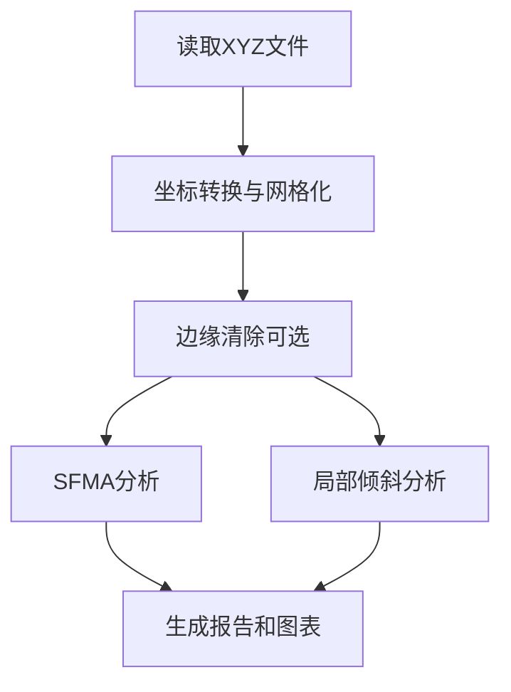

# 面形分析工具 - 指标计算说明

## 概述

本工具用于分析光学表面的面形数据，计算多个关键指标以评估表面质量。所有计算基于XYZ格式的测量数据。

---

## 指标说明

### 1. SFMA (Scanning Field Map Analysis) - 扫描场映射分析

#### 功能
模拟扫描式调平系统中，使用狭缝扫描时的表面残余误差。

#### 原理
在扫描曝光系统中，狭缝在表面上移动并在每个位置进行局部调平。SFMA评估这种动态调平后的残余误差。

#### 计算过程
1. **参数设置**：
   - 狭缝尺寸：26mm(宽) × 8mm(高)，可配置
   - 移动步长：X方向13mm，Y方向1mm
   - 扫描模式：蛇形路径（提高效率）

2. **蛇形扫描**：
   ```
   列0: 从下往上 ↑
   列1: 从上往下 ↓
   列2: 从下往上 ↑
   ...
   ```

3. **逐位置处理**：
   对每个狭缝位置：
   - 提取狭缝覆盖区域的数据点
   - 拟合局部平面：$z_{fit} = ax + by + c$
   - 计算残差：$residual = z - z_{fit}$
   - 累积到结果图中

4. **均值计算**：
   每个点可能被多个狭缝位置覆盖，取所有覆盖位置的残差均值：
   ```
   SFMA_map(x,y) = mean(residuals at position (x,y))
   ```

5. **统计指标**：
   ```
   SFMA = median(SFMA_map) + 3 × std(SFMA_map)
   ```

#### 输出
- 单位：nm (纳米)
- 热力图：显示SFMA分布
- 数据文件：`*-sfma.txt` 包含完整SFMA map
- 显示指标：mean+3σ值

---

### 2. Local Tilt - 局部倾斜角度

#### 功能
评估表面的局部斜率分布，识别高梯度区域。

#### 原理
表面的局部倾斜反映了相邻点之间的高度变化率。过大的局部倾斜可能导致光学性能下降。

#### 计算过程
1. **网格化数据**：
   将离散点数据映射到规则网格

2. **梯度计算**：
   对每个网格点，计算X和Y方向的斜率：
   
   - **内部点**（中心差分）：
     ```
     slope_x = (z[i,j+1] - z[i,j-1]) / (2 × step_x)
     slope_y = (z[i+1,j] - z[i-1,j]) / (2 × step_y)
     ```
   
   - **边缘点**（前向/后向差分）：
     ```
     左边缘: slope_x = (z[i,j+1] - z[i,j]) / step_x
     右边缘: slope_x = (z[i,j] - z[i,j-1]) / step_x
     ```
   
   - **角点**（3×3邻域平面拟合）：
     使用周围有效点拟合局部平面，提取斜率

3. **倾斜角度**：
   ```
   tilt = sqrt(slope_x² + slope_y²)
   ```
   转换为微弧度（μrad）：
   ```
   tilt_μrad = tilt × 10⁶
   ```

4. **统计指标**：
   ```
   Tilt_metric = median(tilt) + 3 × std(tilt)
   Max_tilt = max(tilt)
   ```

#### 输出
- 单位：μrad (微弧度)
- 热力图1：完整局部倾斜分布
- 热力图2：高倾斜区域（>12.5μrad）
- 显示指标：
  - 最大值（max）
  - median+3σ值

---

## 数据处理流程



## 输出文件

| 文件名 | 说明 |
|--------|------|
| `*-processed.txt` | 处理后的网格化数据 |
| `*-sfma.png` | SFMA热力图 |
| `*-sfma.txt` | SFMA完整数据 |
| `*-tilt.png` | 局部倾斜热力图 |
| `*-tilt-high.png` | 高倾斜区域热力图 |

## 参数说明

### 可配置参数

- **数据分辨率** (scale)：原始数据的像素到物理坐标转换比例，默认0.175mm
- **子口径尺寸** (step_x, step_y)：网格化时的步长，默认3.4mm × 0.5mm
- **调平狭缝宽度** (slit_height)：SFMA计算中狭缝的高度，默认8mm
- **边缘清除量** (edge_clearance)：从边缘向内清除的距离，默认50mm

### 固定参数

- NCE场尺寸：26mm × 8mm
- SFMA狭缝宽度：26mm
- SFMA移动步长：X方向13mm，Y方向1mm
- 高倾斜阈值：12.5μrad

---

## 使用建议

1. **SFMA**：评估扫描曝光系统的调平效果
2. **局部倾斜**：识别表面陡峭区域，可能影响成像质量

## 技术参考

- 所有平面拟合使用最小二乘法（numpy.linalg.lstsq）
- 统计计算使用中值（median）和标准差（std）
- 3σ准则用于异常值过滤和指标定义
- 热力图使用jet色图，等高线插值100级
